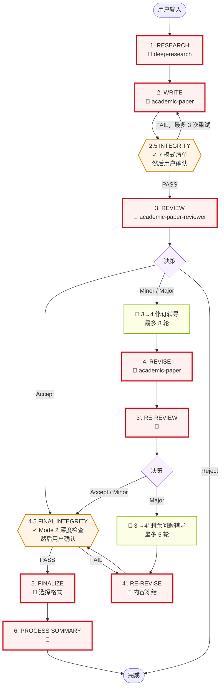
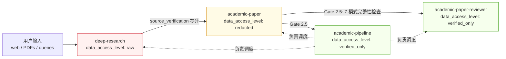
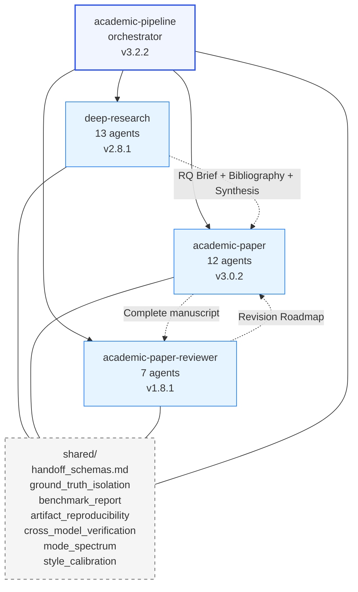
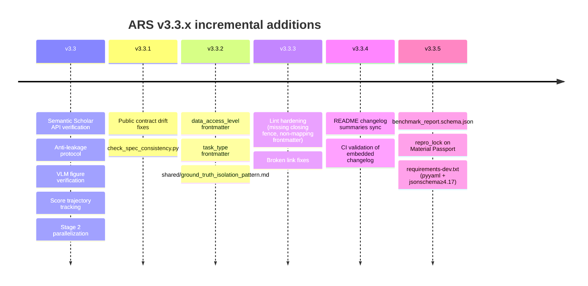

# ARS Pipeline 架构（v3.3.5）

这是一个按阶段 × skill × 产物 × 闸门组织的完整 pipeline 视图。每个完成的阶段都需要一个用户确认 checkpoint（依据 `academic-pipeline/SKILL.md` 和 `pipeline_state_machine.md`）；下方图示会把**决策密集型** checkpoint 单独标出来，方便快速定位。2.5 和 4.5 的阶段后确认 checkpoint 会先经过机器验证，再由用户确认，不能跳过。

## 阅读方式

- **流程图**（§2）：宏观视角，说明哪个阶段接哪个阶段、哪里存在循环、哪里会被闸门阻断。每个矩形实际都以阶段后用户确认收尾（为了可读性省略）；🧑 标记的是用户需要选择分支的决策密集时刻。
- **矩阵**（§3）：唯一把（stage × skill × mode × data_level × artifacts × agents × gate）放在同一个视图中的位置。想回答“Stage X 到底会发生什么？”时，就看这里。Gate 一列同时列出机器检查和结束该阶段的用户确认 checkpoint。
- **数据访问流**（§4）和 **skill 关系图**（§5）：分别回答“谁能看到什么”和“谁依赖谁”。
- **质量闸门**（§6）：放大查看阻断条件，既包含机器强制，也包含人工强制。
- **时间线**（§7）：解释架构为什么长成现在这样，每个 v3.3.x 版本都新增了一个“诚实性原语”。
- **模式清单**（§8）：在组合 pipeline 调用时可作为参考。

只看矩阵是不够的，因为它隐藏了数据访问层级和 skill 依赖；只看图示也不够，因为它隐藏了产物流转和各阶段 agent 细节。两者合起来才是完整架构。

## 1. Checkpoints 概览

这个 pipeline 有**两类用户 checkpoint**。两者都要求用户确认后才能继续推进，只是用户所做的决定不同。

**决策密集型 checkpoints**：用户需要选择一个分支，或接受一个实质性决策：

| # | 阶段 | 用户要决定什么 |
|---|---|---|
| 🧑 1 | 1. RESEARCH | RQ Brief + Methodology Blueprint |
| 🧑 2 | 2. WRITE | 起草前批准大纲 |
| 🧑 3 | 3. REVIEW | 编辑决策（Accept / Minor / Major / Reject） |
| 🧑 4 | 3 → 4 Revision Coaching | 修订策略（最多 8 轮苏格拉底对话；用户可跳过） |
| 🧑 5 | 4. REVISE | 确认修订改动 |
| 🧑 6 | 3'. RE-REVIEW | 验证性复审决策 |
| 🧑 7 | 3' → 4' Residual Coaching | 剩余问题的权衡（最多 5 轮苏格拉底对话；用户可跳过） |
| 🧑 8 | 4'. RE-REVISE | 内容冻结，不再进入后续 review loop |
| 🧑 9 | 5. FINALIZE | 选择输出格式（MD / DOCX / LaTeX / PDF） |
| 🧑 10 | 6. PROCESS SUMMARY | 确认语言 + 审阅协作质量评估 |

**阶段后确认 checkpoints**：先跑机器验证，再由用户确认完整性报告后继续。这些同样属于用户闸门（依据 `pipeline_state_machine.md`，每个阶段都以 `[checkpoint]` 结束），但这里的决定更接近“确认自动报告”，而不是“选择分支”：

| # | 阶段 | 会运行什么 | 用户确认什么 |
|---|---|---|---|
| ✓ 1 | 2.5 INTEGRITY | 7 模式失败检查清单（准确分类见 §3） | Integrity Report PASS/FAIL + 任何 SUSPECTED 标记 |
| ✓ 2 | 4.5 FINAL INTEGRITY | Deep Mode 2 检查，零容忍 | Final Integrity Report PASS + 已填充的 Material Passport |

## 2. Pipeline 流程

**图例：**
- **红色实线（🧑）** = 决策密集型人工闸门，用户选择分支或批准实质性决策。
- **橙色实线（✓）** = 完整性闸门，先进行机器验证，再由用户确认报告。不能跳过。
- **绿色** = 苏格拉底式辅导子阶段。用户可以参与，也可以说“直接帮我改”来跳过对话。

## 3. 阶段 × 维度矩阵

| Stage | Skill / Mode | 数据级别 | 产出物 | 核心 agents | 闸门 / Checkpoint |
|---|---|---|---|---|---|
| **1. RESEARCH** | `deep-research` v2.8.1（full / socratic / lit-review / systematic-review / fact-check / review / quick） | RAW | RQ Brief；Methodology Blueprint；Annotated Bibliography（S2 验证）；Synthesis Report；INSIGHT Collection | research_question_agent；research_architect_agent；bibliography_agent；source_verification_agent；synthesis_agent；meta_analysis_agent；editor_in_chief_agent；devils_advocate_agent；risk_of_bias_agent；ethics_review_agent；socratic_mentor_agent；report_compiler_agent；monitoring_agent（13 agents） | 🧑 **决策密集型 checkpoint：** 用户确认 RQ brief + methodology。机器检查：S2 API Tier-0 验证（Levenshtein ≥ 0.70）；证据层级评分；对 DA 的反逢迎检查（1-5 分，只有 ≥ 4 才能让步） |
| **2. WRITE** | `academic-paper` v3.0.2（full / plan / outline-only / lit-review / revision-coach / abstract-only / citation-check / disclosure / format-convert / revision） | REDACTED | Paper Configuration Record；Outline；Argument Map；Draft Text；Bilingual Abstract；Figures + Captions；Citation List | 12-agent pipeline：intake_agent；literature_strategist_agent；structure_architect_agent；argument_builder_agent；draft_writer_agent；citation_compliance_agent；abstract_bilingual_agent；peer_reviewer_agent；formatter_agent；socratic_mentor_agent；visualization_agent；revision_coach_agent | 🧑 **决策密集型 checkpoint：** 起草前先批准大纲。机器检查：anti-leakage protocol（缺乏材料支撑的填充 → `[MATERIAL GAP]`）；VLM figure verification（10 项 APA 清单，最多 2 次迭代）；style calibration 与用户文风对齐；Stage 2 并行化（大纲后并行运行 Phase 1 + visualization） |
| **2.5 INTEGRITY** | `academic-pipeline` v3.2.2（gate） | VERIFIED_ONLY | Material Passport（Schema 9，必需）+ `repro_lock`（v3.3.5，声明字段，可为已填充内容或 `null`）；Claim Verification Report（审稿前抽样：30% claims，至少 10 条，依据 `claim_verification_protocol.md`）；Data Provenance Audit | integrity_verification_agent；state_tracker_agent；pipeline_orchestrator_agent | ✓ **完整性闸门** + 用户确认。7 模式 AI 失败检查清单（Lu 2026，规范顺序见 `ai_research_failure_modes.md`）：**M1** 实现 bug 通过 AI 自审；**M2** 引用幻觉；**M3** 实验结果幻觉；**M4** 取巧依赖；**M5** 把实现 bug 包装成新发现；**M6** 方法论伪造；**M7** 早期 pipeline 阶段的 frame-lock。审稿前使用 claim 抽样模式。FAIL → 修复并重新验证（最多 3 轮） |
| **3. REVIEW** | `academic-paper-reviewer` v1.8.1（full / guided / quick / methodology-focus / calibration） | VERIFIED_ONLY | **首轮审稿包**（依据 `academic-paper-reviewer/SKILL.md`）：5 份 review report（EIC + R1 methodology + R2 domain + R3 interdisciplinary + Devil's Advocate）+ Editorial Decision（Accept / Minor / Major / Reject）+ Revision Roadmap | field_analyst_agent（自动识别领域，并配置 3 位自适应 reviewer）；eic_agent；methodology_reviewer_agent；domain_reviewer_agent；perspective_reviewer_agent；devils_advocate_reviewer_agent；editorial_synthesizer_agent（7 agents） | 🧑 **决策密集型 checkpoint：** 用户审阅 editorial decision。机器检查：让步阈值协议（DA 的 rebuttal 由回应方打 1-5 分，低于 4 不得让步）；修订过程中保持攻击强度；跨模型 DA critique（可选，`ARS_CROSS_MODEL` 环境变量）；只读约束（不得引入新 claim） |
| **3 → 4 Revision Coaching** | `academic-paper-reviewer`（EIC 苏格拉底子阶段） | VERIFIED_ONLY | Revision strategy 对话（不是向前交接的正式产物，但会馈入 Stage 4 的修订计划） | eic_agent | 🧑 **决策密集型 checkpoint：** 与 EIC 进行苏格拉底对话（最多 8 轮）。用户可说“直接帮我改”跳过。来源：`two_stage_review_protocol.md` |
| **4. REVISE** | `academic-paper` v3.0.2（revision / revision-coach） | REDACTED | Point-by-Point Response；Revised Draft；Delta Report（改了什么 + 为什么改） | revision_coach_agent（v3.3 苏格拉底模式）；draft_writer_agent（重新进入）；argument_builder_agent（如涉及结构调整） | 🧑 **决策密集型 checkpoint：** 用户确认修订内容。机器检查：按 rubric 维度记录 score trajectory（v3.3）；若修订导致某维度退步则会被标记 |
| **3'. RE-REVIEW** | `academic-paper-reviewer` v1.8.1（re-review） | VERIFIED_ONLY | **验证包**（依据 `academic-paper-reviewer/SKILL.md` 中的 re-review 规格）：Revision response checklist + residual issues list + 新的 Decision（Accept / Minor / Major）+ **R&R Traceability Matrix（Schema 11）**，含 Author's Claim + Verified? 两列 | **窄化复审团队**：field_analyst_agent + eic_agent + editorial_synthesizer_agent（3 agents，不再使用 Stage 3 的完整 panel） | 🧑 **决策密集型 checkpoint：** 用户审阅验证性决策。硬性上限：**最多 1 轮 RE-REVISE；Stages 4 + 4' 合计最多 2 个修订循环**。若 3' 为 Major → Residual Coaching → Stage 4' |
| **3' → 4' Residual Coaching** | `academic-paper-reviewer`（EIC 苏格拉底子阶段） | VERIFIED_ONLY | 剩余问题对话 | eic_agent | 🧑 **决策密集型 checkpoint：** 围绕剩余问题的权衡进行苏格拉底对话（最多 5 轮）。用户可跳过。来源：`two_stage_review_protocol.md` |
| **4'. RE-REVISE** | `academic-paper` v3.0.2（revision） | REDACTED | Final Revised Draft（终态，之后进入 4.5） | draft_writer_agent；revision_coach_agent | 🧑 **决策密集型 checkpoint：** 用户确认内容冻结。之后不再允许进入新的 review loop |
| **4.5 FINAL INTEGRITY** | `academic-pipeline` v3.2.2（gate） | VERIFIED_ONLY | 更新后的 Material Passport（`verification_status: VERIFIED`）+ 已声明的 `repro_lock`（可为已填充内容，也可显式为 `null` 以诚实放弃）；Claim Verification Report（**final-check mode：100% claims**，依据 `claim_verification_protocol.md`） | integrity_verification_agent（对 7 种模式进行更深一轮复查）；state_tracker_agent | ✓ **完整性闸门** + 用户确认。**对 7 模式复查实行零容忍；不可跳过。** 任何在 2.5 标为 SUSPECTED 的模式，到 4.5 时必须变成 CLEAR，或由用户给出 Override。`repro_lock` **不会**在运行时被完整性闸门读取（见 `artifact_reproducibility_pattern.md`）；如果填写了该字段，则 `stochasticity_declaration` 必须逐字一致，并由独立脚本 `check_repro_lock.py` 验证。这是事后文档记录，不是运行时阻断 |
| **5. FINALIZE** | `academic-paper` v3.0.2（format-convert / disclosure） | VERIFIED_ONLY | 可发布的 MD；DOCX（若有 Pandoc）；LaTeX（需用户确认）；PDF（tectonic）；AI Disclosure Statement（按投稿 venue 生成） | formatter_agent | 🧑 **决策密集型 checkpoint：** 渲染前用户选择输出格式。Disclosure statement 必须匹配对应 venue（ICLR / NeurIPS / Nature / Science / ACL / EMNLP） |
| **6. PROCESS SUMMARY** | `academic-pipeline` v3.2.2 | VERIFIED_ONLY | Paper Creation Process Record（MD + PDF）；AI Self-Reflection Report（让步率、逢迎风险、health alerts、Failure Mode Audit Log）；Score trajectory 可视化 | state_tracker_agent；pipeline_orchestrator_agent | 🧑 **决策密集型 checkpoint：** 用户确认输出语言。系统会进行协作质量评估。如已进入同行评审发表后阶段，还会生成 post-publication audit report |

## 4. 数据访问级别流（v3.3.2+）

规则（依据 `shared/ground_truth_isolation_pattern.md`）：

- `data_access_level` 是一种**声明式**标注，不是运行时强制权限系统。CI lint `scripts/check_data_access_level.py` 只确认每个 `SKILL.md` 都有合法取值，不会在运行时检查上下文窗口。
- `raw` skills 消费第一层数据（任意输入，可能带对抗性）。
- `redacted` skills 只处理净化后的材料，不再引入新的 raw 数据。
- `verified_only` skills 只能在上游完整性闸门通过后运行。
- reviewer 侧**可以私下持有 rubric**，但核心保证是：rubric / gold-label 内容不能出现在生成候选答案的 agent 上下文中。calibration 用的 gold set 由研究者在运行时提供，而不是随仓库分发。
- Stage 2.5 和 Stage 4.5（再加上用户在每个闸门处的确认）才是真正的执行点。这个 pattern 文档是在解释让这些闸门成立的数据流结构，本身不是运行时锁。

## 5. Skill 依赖图

## 6. 质量闸门

闸门有两类：**🧑 决策密集型**（用户选择分支或批准材料）和 **✓ 完整性**（机器验证 + 用户确认）。纯机器强制的 🤖 lint 检查运行在 CI 中。

| 闸门 | 类别 | 阶段 | 什么会阻断推进 | 失败后的处理 |
|---|---|---|---|---|
| RQ + methodology 确认 | 🧑 | 1 | 用户尚未批准 RQ Brief 和 Methodology Blueprint | 修改后重新提交 |
| S2 API verification | 🤖 | 1 | 引用不在 Semantic Scholar 中；标题 Levenshtein < 0.70 | 进行标记；用户决定删除或重新引用 |
| 大纲批准 | 🧑 | 2 | 用户尚未批准大纲 | 修改后重新提交 |
| Anti-leakage（v3.3） | 🤖 | 2 | 草稿中包含未被会话材料支撑的参数化填充 | 标记为 `[MATERIAL GAP]`；用户补材料或接受缺口 |
| VLM figure verify（v3.3） | 🤖 | 2 | 渲染后的图表未通过 10 项 APA 7.0 清单 | 最多 2 次修正迭代 |
| Stage 2.5 integrity + ack | ✓ | 2.5 | 7 模式检查中任一模式为 SUSPECTED，或 Modes 1/3/5/6 为 INSUFFICIENT EVIDENCE，或用户尚未确认报告 | 修复并重新验证（最多 3 轮）；或由用户给出 Override 理由（会记录） |
| Editor-in-Chief 决策审阅 | 🧑 | 3 | 用户尚未审阅 decision letter | 展示决策，等待用户 |
| 让步阈值 | 🤖 | 3 | DA rebuttal 由回应方评分低于 4/5 | 不允许让步；同时触发 frame-lock detector |
| Revision Coaching | 🧑 | 3→4 | 用户既未参与，也未明确跳过（最多 8 轮） | 用户可说“直接帮我改”跳过 |
| 修订确认 | 🧑 | 4 | 用户尚未确认改动 | 修改后重新展示 |
| 修订循环上限 | 🤖 | 4 / 3' / 4' | 已经消耗 2 次修订循环 | 强制推进到 Stage 4.5 |
| Residual Coaching | 🧑 | 3'→4' | 用户既未参与，也未明确跳过（最多 5 轮） | 用户可说“直接帮我改”跳过 |
| 内容冻结确认 | 🧑 | 4' | 用户尚未确认冻结 | 等待用户；之后不再允许 review loop |
| Stage 4.5 final integrity + ack | ✓ | 4.5 | 更深一轮 7 模式复查中存在**任何**问题；或仍残留 2.5 时的 SUSPECTED 项 | 零容忍；不可跳过；修复并重新验证 |
| 格式选择 | 🧑 | 5 | 用户尚未选择输出格式 | 等待用户选择 |
| Disclosure check | 🤖 | 5 | 缺少 venue-specific AI disclosure，或格式错误 | 阻止渲染，直到修复 |
| `repro_lock`（v3.3.5） | 🤖（独立） | — | Material Passport v3.3.5+ 必须包含 `repro_lock`；值必须是已填充对象或显式 `null`（诚实 opt-out）。已填充对象由 `check_repro_lock.py` 校验。依据 `artifact_reproducibility_pattern.md`：**默认不会**接入 CI lint，也**不会**在 Stage 2.5 / 4.5 运行时被完整性闸门读取——这是事后文档记录，不是 pipeline 阻断项 | 按需运行 `check_repro_lock.py <passport>` |
| 语言 + 协作评审 | 🧑 | 6 | 用户尚未确认输出语言 / 审阅自我反思 | 等待用户 |
| `benchmark_report`（v3.3.5，外部） | 🤖 | — | 发布 benchmark 时没有诚实披露 | 用户在发布前运行 `check_benchmark_report.py` |

## 7. v3.3.x 演进时间线

## 8. Skill Modes

| Skill | 模式 |
|---|---|
| `deep-research` v2.8.1 | full, quick, socratic, review, lit-review, fact-check, systematic-review（7） |
| `academic-paper` v3.0.2 | full, plan, outline-only, revision, revision-coach, abstract-only, lit-review, format-convert, citation-check, disclosure（10） |
| `academic-paper-reviewer` v1.8.1 | full, re-review, quick, methodology-focus, guided, calibration（6） |
| `academic-pipeline` v3.2.2 | （orchestrator，负责委派到各子 skill mode；没有独立 mode） |
